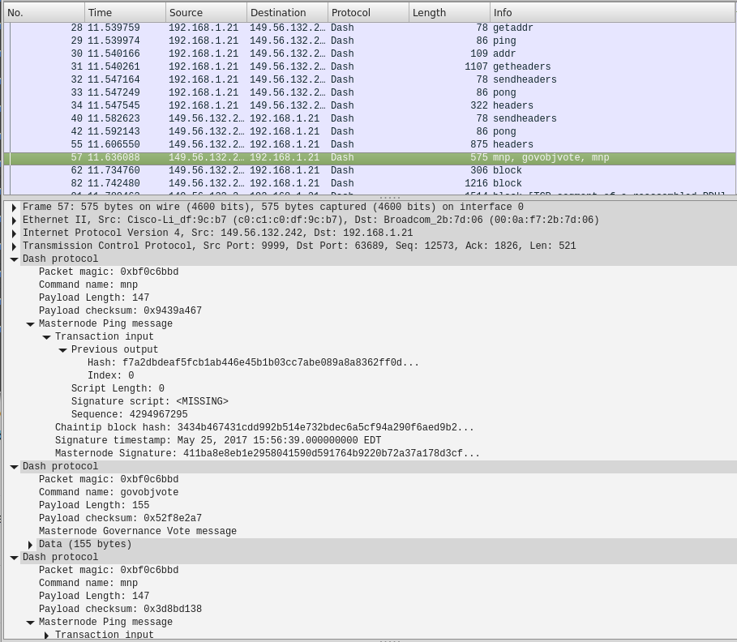

# Wireshark dissector plugin for the [Dash](https://www.dash.org/) cryptocurrency protocol
A Dash protocol dissector converted from the bitcoin built-in dissector and updated to include Dash specific commands (based on [outdated protocol documentation](https://github.com/dashpay/dash/blob/master/dash-docs/protocol-documentation.md) and [source code](https://github.com/dashpay/dash/blob/master/src/protocol.cpp)).

## To Build (on Linux Mint 17.3)
 - Clone Wireshark from [https://github.com/wireshark/wireshark](https://github.com/wireshark/wireshark) 
 - Clone this plugin repository
 - From this repository, copy *CMakeListsCustom.txt* / the *plugins* folder and paste into the root of the cloned Wireshark folder
 - Follow the Wireshark build instructions

## Releases
 - Currently the plugin has only been built on Linux Mint 64 bit.  A binary can be downloaded from the [releases page](https://github.com/thephez/wireshark-plugin-dash/releases/latest).

## Capture screenshot
This shows a dissected Masternode Ping message. The packet also contains a Governance Vote.  Most Dash specific messages are not fully dissected, but all should be recognized.

