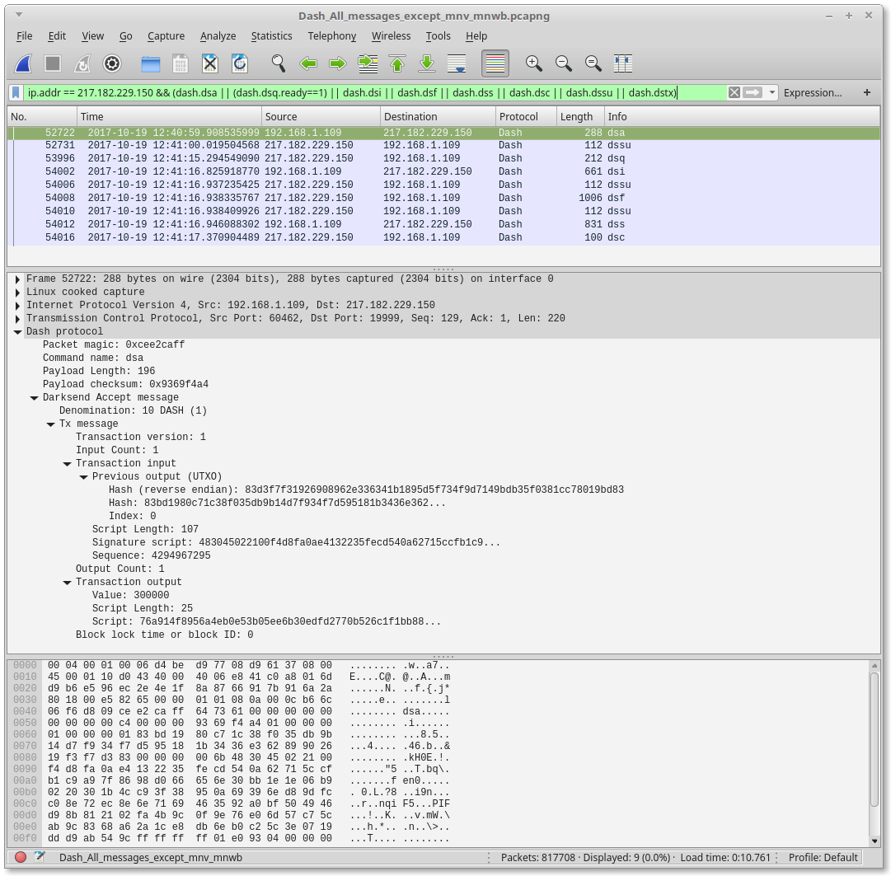

# Wireshark dissector plugin for the [Dash](https://www.dash.org/) cryptocurrency protocol
A Dash protocol dissector converted from the bitcoin built-in dissector and updated to include Dash specific commands (based on [outdated protocol documentation](https://github.com/dashpay/dash/blob/v0.12.2.x/dash-docs/protocol-documentation.md) and [source code](https://github.com/dashpay/dash/blob/master/src/protocol.cpp)). All messages are now dissected in significant detail.

Current limitations:
 - Governance object (`govobj`) data field is not dissected
 - The script field of TxOuts is not dissected

## To Build (on Linux Mint 17.3)
 - Clone Wireshark from [https://github.com/wireshark/wireshark](https://github.com/wireshark/wireshark)
 - Clone this plugin repository
 - From this repository, copy *CMakeListsCustom.txt* / the *plugins* folder and paste into the root of the cloned Wireshark folder
 - Follow the Wireshark build instructions

Note: This was built with Wireshark 2.3.  To use with Wireshark 2.2 it is necessary to build using the master-2.2 branch of this repository

## Releases
 - Currently the plugin has only been built on Linux Mint 64 bit.  A binary can be downloaded from the [releases page](https://github.com/thephez/wireshark-plugin-dash/releases/latest).

## Capture screenshot
This shows a dissected Masternode Ping message. The packet also contains a Governance Vote.


## Dash specific protocol implementation status (excludes items shared with the Bitcoin protocol)
Name | Recognized | Dissected | Status | Description
--- | --- | --- | --- | ---
[blocktxn](https://dash-docs.github.io/en/developer-reference#blocktxn) | Y | Y | | Block Transactions (compact block-related)
[cmpctblock](https://dash-docs.github.io/en/developer-reference#cmpctblock) | Y | Y | | Compact Block
[dsa](https://github.com/dashpay/dash/blob/master/dash-docs/protocol-documentation.md#dsaccept---dsa) | Y | Y |  | Darksend Accept
[dsc](https://github.com/dashpay/dash/blob/master/dash-docs/protocol-documentation.md#dscomplete---dsc) | Y | Y |  | Darksend Complete
[dseg](https://github.com/dashpay/dash/blob/master/dash-docs/protocol-documentation.md#dseg---dseg) | Y | Y |  | Masternode List/Entry Sync
[dsf](https://github.com/dashpay/dash/blob/master/dash-docs/protocol-documentation.md#dsfinaltx---dsf) | Y | Y |  | Darksend Final Transaction
[dsi](https://github.com/dashpay/dash/blob/master/dash-docs/protocol-documentation.md#dsvin---dsi) | Y | Y |  | Darksend Entry
[dsq](https://github.com/dashpay/dash/blob/master/dash-docs/protocol-documentation.md#dsqueue---dsq) | Y | Y |  | Darksend Queue
[dss](https://github.com/dashpay/dash/blob/master/dash-docs/protocol-documentation.md) | Y | Y |  | Darksend Sign Final Transaction
[dssu](https://github.com/dashpay/dash/blob/master/dash-docs/protocol-documentation.md#dsstatusupdate---dssu) | Y | Y |  | Mixing Pool Status Update
[dstx](https://github.com/dashpay/dash/blob/master/dash-docs/protocol-documentation.md#dstx---dstx) | Y | Y |  | Darksend Broadcast
[getblocktxn](https://dash-docs.github.io/en/developer-reference#getblocktxn) | Y | Y | | Get block transaction(s) (compact block-related)
[govobj](https://github.com/dashpay/dash/blob/master/dash-docs/protocol-documentation.md#mngovernanceobject---govobj) | Y | Y |  | Governance Object
[govobjvote](https://github.com/dashpay/dash/blob/master/dash-docs/protocol-documentation.md#mngovernanceobjectvote---govobjvote) | Y | Y |  | Governance Vote
[govsync](https://github.com/dashpay/dash/blob/master/dash-docs/protocol-documentation.md#mngovernancesync---govsync) | Y | Y |  | Governance Object Sync
[ix](https://github.com/dashpay/dash/blob/master/dash-docs/protocol-documentation.md#txlockrequest---ix) | Y | Y |  | Transaction Lock Request (InstantSend)
[mnb](https://github.com/dashpay/dash/blob/master/dash-docs/protocol-documentation.md#mnannounce---mnb) | Y | Y |  | Masternode Broadcast
[mnget](https://github.com/dashpay/dash/blob/master/dash-docs/protocol-documentation.md#masternodepaymentsync---mnget) | Y | Y |  | Masternode Payment Sync
[mnp](https://github.com/dashpay/dash/blob/master/dash-docs/protocol-documentation.md#mnping---mnp) | Y | Y |  | Masternode Ping
[mnv](https://github.com/dashpay/dash/blob/master/dash-docs/protocol-documentation.md#mnverify---mnv) | Y | Y |  | Masternode Verify
[mnw](https://github.com/dashpay/dash/blob/master/dash-docs/protocol-documentation.md#masternodepaymentvote---mnw) | Y | Y |  | Masternode Payment Vote
[mnwb](https://github.com/dashpay/dash/blob/master/dash-docs/protocol-documentation.md#masternodepaymentblock---mnwb) | Y | NA | Inventory only | Masternode Payment Block (no message - inventory only)
[sendcmpct](https://dash-docs.github.io/en/developer-reference#sendcmpct) | Y | Y | | Send compact blocks
[spork](https://github.com/dashpay/dash/blob/master/dash-docs/protocol-documentation.md#spork---spork)| Y | Y |  | Spork status
[ssc](https://github.com/dashpay/dash/blob/master/dash-docs/protocol-documentation.md#syncstatuscount---ssc) | Y | Y |  | Sync Status Count
[txlvote](https://github.com/dashpay/dash/blob/master/dash-docs/protocol-documentation.md#txlockvote---txlvote) | Y | Y |  | Transaction Lock Vote

## Example display filter
This example of using display filters shows how to show messages related to a
PrivateSend session.

```
ip.addr == 217.182.229.150 && (dash.dsa || (dash.dsq.ready==1) || dash.dsi || \
  dash.dsf || dash.dss || dash.dsc || dash.dssu || dash.dstx)
```

